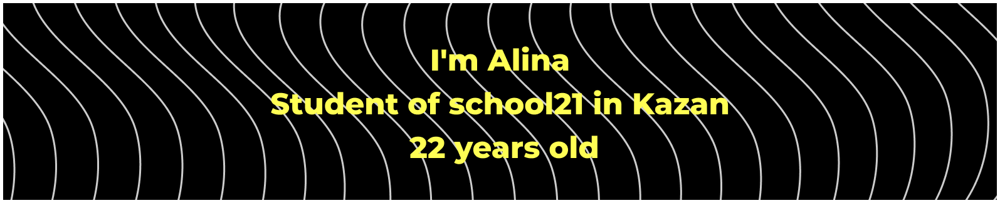

## Skills
HTML, CSS, JavaScript, C, Postgresql

## Contact me
 sultanova.6@mail.ru  

 @gelectrl  

### Frontend projects:
| Project name | Description | Tools | Link |
|-|-|-|-|
| [marathonJS]([https://github.com/sultanova6/vueMarket](https://github.com/sultanova6/marathonJS)) | Picture gallery, to-do list base, picture slider, glowing squares, reaction game | html, css, js |
| [vueMarket(in progress)](https://github.com/sultanova6/vueMarket) | A Vue.js-based web application that allows users to browse and purchase products online.. | vue, vue cli, json-server, axios, getting data from the API, vuex store | npm run serve |
| [ToDoList_JS](https://github.com/sultanova6/ToDoList_JS) | Task List. You can add, delete and edit a task. Also, if you try to add the same or an empty task, an error message pops up. | DOM, Instance methods, Web Storage API, HTML DOM API | https://sultanova6.github.io/ToDoList_JS/ |
 

### School projects:
| Project name | Description | Tools |
|-|-|-|
| [RetailAnalitycs v1.0](https://github.com/sultanova6/RetailAnalitycs_v1.0) | Making database with data about retailers' customers, and write the views and procedures needed to create personal offers | PostgreSQL
| [Info21_v1.0](https://github.com/sultanova6/Info21_v1.0) | Making database with data about School 21 and write procedures, functions and triggers | PostgreSQL
| [SQL_Bootcamp](https://github.com/sultanova6/SQL_Bootcamp) | A 14-day long intensive course covering topics from SQL Core | PostgreSQL
| [3DViewer_v1.0](https://github.com/sultanova6/3DViewer_v1.0) | Program for viewing 3d objects | C/C++, Make, QT, OpenGL, Check tests
| [SmartCalc_v1.0](https://github.com/sultanova6/SmartCalc_v1.0) | Implementation of a calculator with a user interface, mathematical functions and plotting graphs | C/C++, Make, QT, QCustomPlot, Check tests
| [s21_matrixplus](https://github.com/sultanova6/s21_matrixplus) | Library for working with matrices (C++) | C++, Make, GoogleTest
| [s21_decimal](https://github.com/sultanova6/s21_decimal) | Implementation of decimal.h library from C# | C, Make, Check tests
| [s21_math](https://github.com/sultanova6/s21_math) | Implementation of some functions of the math.h library | C, Make, Check tests
| [SimpleBashUtils](https://github.com/sultanova6/SimpleBashUtils) | Implementation of of Bash text utilities: cat, grep | C, Make, Check tests
| [string.h](https://github.com/sultanova6/s21_string) | Implementation of some functions of the string.h library | C, Make, Check tests
| [CICD](https://github.com/sultanova6/CICD) | Training project on building, testing and deployment using GitLab CI/CD | GitLab CI/CD
| [LinuxNetwork](https://github.com/sultanova6/Linux_Network) | Training project on network configuration on Linux virtual machines                              | Linux, ipcalc, netstat, iperf3, iptables, nmap, dhcp server, apache2, ssh
| [LinuxMonitoring_v1.0](https://github.com/sultanova6/LinuxMonitoring_v1.0) | Training project on bash scripting and system research | Linux, Bash, vmstat, find, du, grep, awk, sort, time
| [Docker](https://github.com/sultanova6/Docker) | Training project on developing docker image with server | Docker, Bash, C, FastCgi, nginx, Dockle, Docker Compose
 
