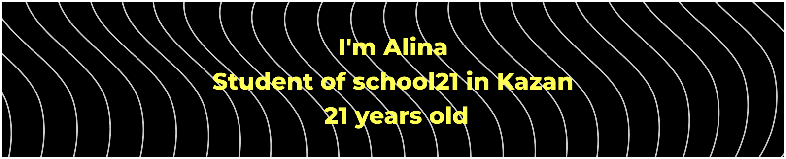

<!--
**sultanova6/sultanova6** is a ✨ _special_ ✨ repository because its `README.md` (this file) appears on your GitHub profile.

Here are some ideas to get you started:

- 🔭 I’m currently working on ...
- 🌱 I’m currently learning ...
- 👯 I’m looking to collaborate on ...
- 🤔 I’m looking for help with ...
- 💬 Ask me about ...
- 📫 How to reach me: ...
- 😄 Pronouns: ...
- ⚡ Fun fact: ...
-->

## About me

I am writing projects in C, in the near future I will open a branch with tasks in C++.  
I have a little experience in QT (in the SmartCalc_v1.0 project), I have experience in HTML, CSS.  
I study queries in PostgreSQL at my leisure.  

## Language and Tools

C

## Follow me
 sultanova.6@mail.ru

 @sultanovadesign

 +7(987) 061 67-18